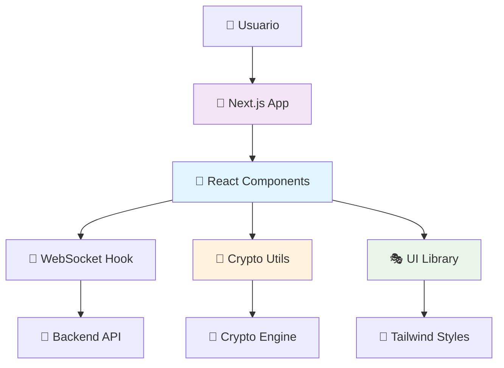

# 🎨 Chat Anónimo - Frontend

<div align="center">


**Interfaz moderna y responsive para chat anónimo seguro**

[🏠 Proyecto Principal](../README.md) | [🚀 Backend](../backend/README.md) | [🌐 Demo](https://write-ghost.netlify.app)

</div>

---

## 🌟 Características del Frontend

### 🎨 **Interfaz Moderna**
- **⚡ Next.js 14** - Framework React de última generación
- **📱 Responsive Design** - Optimizado para móviles y escritorio
- **🌙 Modo Oscuro/Claro** - Tema adaptable automático
- **🎭 UI Components** - Biblioteca de componentes reutilizables
- **💨 TailwindCSS** - Estilos utilitarios y modernos

### 🔐 **Seguridad Integrada**
- **🔒 Cifrado en Cliente** - Procesamiento local de cifrado
- **🔑 Gestión de Claves** - Manejo seguro de claves de sala
- **🚫 Sin Persistencia** - Datos sensibles solo en memoria
- **⚡ WebSocket Seguro** - Conexiones WSS en producción
- **🛡️ Validación** - Input sanitization y validación

### 📁 **Funcionalidades Avanzadas**
- **📎 Drag & Drop** - Subida intuitiva de archivos
- **🖼️ Vista Previa** - Previsualizador de imágenes integrado
- **📊 Indicadores** - Estado de conexión y escritura
- **🔔 Notificaciones** - Sistema de alertas elegante
- **⏰ Auto-Refresh** - Reconexión automática

---

## 🏗️ Arquitectura del Frontend



### 📂 **Estructura de Archivos**

```
frontend/
├── 🎨 app/
│   ├── 📄 page.tsx           # Página principal
│   ├── 🎨 layout.tsx         # Layout base
│   └── 🌐 globals.css        # Estilos globales
├── 🧩 components/
│   ├── 💬 chat-interface.tsx # Interfaz principal de chat
│   ├── 📨 chat-message.tsx   # Componente de mensaje
│   ├── 📁 file-upload.tsx    # Subida de archivos
│   ├── 👥 user-list.tsx      # Lista de usuarios
│   ├── 🏠 room-manager.tsx   # Gestión de salas
│   ├── 🌙 theme-toggle.tsx   # Cambio de tema
│   └── 🎭 ui/                # Componentes base UI
├── 🔧 lib/
│   ├── 📡 chat-api.ts        # API WebSocket
│   ├── 🔐 crypto.ts          # Utilidades de cifrado
│   ├── 🔄 crypto-fallback.ts # Fallback para cifrado
│   └── 🛠️ utils.ts           # Utilidades generales
├── 📦 hooks/
│   ├── 📱 use-mobile.ts      # Hook para móviles
│   └── 🔔 use-toast.ts       # Hook para notificaciones
└── 🎯 public/                # Recursos estáticos
```

---

## 🚀 Instalación y Desarrollo

### 📋 **Requisitos**
- **Node.js 18+**
- **npm** o **pnpm**
- **Git**

### ⚡ **Instalación Rápida**

```bash
# Clonar repositorio
git clone https://github.com/h3n-x/chat-anonimo.git
cd chat-anonimo/frontend

# Instalar dependencias
npm install
# o
pnpm install

# Desarrollo local
npm run dev
# o  
pnpm dev

# Abrir http://localhost:3000
```

### 🏗️ **Build para Producción**

```bash
# Build estático para Netlify/Vercel
npm run build

# Preview del build
npm run start

# Exportación estática
npm run export
```

---

## ⚙️ Configuración

### 🔧 **Variables de Entorno**

```bash
# .env.local
NEXT_PUBLIC_WS_URL=ws://localhost:8000
NEXT_PUBLIC_API_URL=http://localhost:8000
NEXT_PUBLIC_APP_NAME="Chat Anónimo"

# .env.production  
NEXT_PUBLIC_WS_URL=wss://chat-backend-haeb.onrender.com
NEXT_PUBLIC_API_URL=https://chat-backend-haeb.onrender.com
```

### 📝 **next.config.mjs**

```javascript
/** @type {import('next').NextConfig} */
const nextConfig = {
  output: 'export',
  trailingSlash: true,
  images: {
    unoptimized: true
  },
  typescript: {
    ignoreBuildErrors: false
  },
  eslint: {
    ignoreDuringBuilds: false
  }
}

export default nextConfig
```

---

## 🧩 Componentes Principales

### 💬 **ChatInterface**

```tsx
// components/chat-interface.tsx
export function ChatInterface() {
  const { 
    messages, 
    sendMessage, 
    uploadFile,
    connected 
  } = useChatApi()
  
  return (
    <div className="flex h-screen">
      <MessageList messages={messages} />
      <UserList />
      <FileUpload onUpload={uploadFile} />
    </div>
  )
}
```

### 🔐 **Crypto Integration**

```tsx
// lib/crypto.ts
export async function encryptMessage(
  message: string, 
  roomKey: string
): Promise<EncryptedData> {
  const encoder = new TextEncoder()
  const data = encoder.encode(message)
  
  const key = await importKey(roomKey)
  const nonce = crypto.getRandomValues(new Uint8Array(12))
  
  const encrypted = await crypto.subtle.encrypt(
    { name: 'AES-GCM', iv: nonce },
    key,
    data
  )
  
  return {
    data: arrayBufferToBase64(encrypted),
    nonce: arrayBufferToBase64(nonce),
    algorithm: 'AES-256-GCM'
  }
}
```

### 📁 **File Upload**

```tsx
// components/file-upload.tsx
export function FileUpload({ onUpload }: FileUploadProps) {
  const { getRootProps, getInputProps, isDragActive } = useDropzone({
    onDrop: handleFiles,
    maxSize: 15 * 1024 * 1024, // 15MB
    maxFiles: 5
  })
  
  return (
    <div {...getRootProps()} className="upload-zone">
      <input {...getInputProps()} />
      {isDragActive ? (
        <p>📁 Suelta los archivos aquí...</p>
      ) : (
        <p>📎 Arrastra archivos o haz clic</p>
      )}
    </div>
  )
}
```

---

## 🎨 Sistema de Temas

### 🌙 **Modo Oscuro/Claro**

```tsx
// components/theme-provider.tsx
export function ThemeProvider({ children }: ThemeProviderProps) {
  const [theme, setTheme] = useState<'light' | 'dark'>('light')
  
  useEffect(() => {
    const systemTheme = window.matchMedia('(prefers-color-scheme: dark)')
    setTheme(systemTheme.matches ? 'dark' : 'light')
  }, [])
  
  return (
    <div className={`theme-${theme}`} data-theme={theme}>
      {children}
    </div>
  )
}
```

### 🎨 **Estilos Personalizados**

```css
/* styles/globals.css */
@tailwind base;
@tailwind components;
@tailwind utilities;

@layer base {
  :root {
    --background: 0 0% 100%;
    --foreground: 222.2 84% 4.9%;
    --primary: 221.2 83.2% 53.3%;
    --secondary: 210 40% 96%;
  }
  
  .dark {
    --background: 222.2 84% 4.9%;
    --foreground: 210 40% 98%;
    --primary: 217.2 91.2% 59.8%;
    --secondary: 217.2 32.6% 17.5%;
  }
}
```

---

## 📱 Responsive Design

### 📊 **Breakpoints**

```typescript
// hooks/use-mobile.ts
export function useMobile() {
  const [isMobile, setIsMobile] = useState(false)
  
  useEffect(() => {
    const checkDevice = () => {
      setIsMobile(window.innerWidth < 768)
    }
    
    checkDevice()
    window.addEventListener('resize', checkDevice)
    
    return () => window.removeEventListener('resize', checkDevice)
  }, [])
  
  return isMobile
}
```

### 📱 **Layouts Adaptativos**

```tsx
// components/chat-layout.tsx
export function ChatLayout() {
  const isMobile = useMobile()
  
  return (
    <div className={`chat-layout ${isMobile ? 'mobile' : 'desktop'}`}>
      {isMobile ? (
        <MobileChatInterface />
      ) : (
        <DesktopChatInterface />
      )}
    </div>
  )
}
```

---

## 🔔 Sistema de Notificaciones

### 🎯 **Toast Notifications**

```tsx
// hooks/use-toast.ts
export function useToast() {
  const [toasts, setToasts] = useState<Toast[]>([])
  
  const toast = useCallback((message: string, type: 'success' | 'error' | 'info') => {
    const id = Math.random().toString(36).substr(2, 9)
    const newToast = { id, message, type }
    
    setToasts(prev => [...prev, newToast])
    
    setTimeout(() => {
      setToasts(prev => prev.filter(t => t.id !== id))
    }, 5000)
  }, [])
  
  return { toast, toasts }
}
```

---

## 🌍 Deployment

### 🚀 **Netlify**

```toml
# netlify.toml
[build]
  command = "npm run build"
  publish = "out"

[[redirects]]
  from = "/*"
  to = "/index.html"
  status = 200

[build.environment]
  NEXT_PUBLIC_WS_URL = "wss://chat-backend-haeb.onrender.com"
```

### ⚡ **Vercel**

```json
{
  "buildCommand": "npm run build",
  "outputDirectory": "out",
  "framework": "nextjs",
  "env": {
    "NEXT_PUBLIC_WS_URL": "wss://chat-backend-haeb.onrender.com"
  }
}
```

### 🔧 **GitHub Actions**

```yaml
# .github/workflows/deploy.yml
name: Deploy Frontend
on:
  push:
    branches: [main]
    paths: ['frontend/**']

jobs:
  deploy:
    runs-on: ubuntu-latest
    steps:
      - uses: actions/checkout@v3
      - uses: actions/setup-node@v3
        with:
          node-version: '18'
      - run: npm ci
        working-directory: ./frontend
      - run: npm run build
        working-directory: ./frontend
```

---

## 🧪 Testing y Calidad

### 🔬 **Testing Setup**

```bash
# Instalar herramientas de testing
npm install --save-dev @testing-library/react @testing-library/jest-dom jest

# Ejecutar tests
npm run test

# Coverage
npm run test:coverage
```

### 📊 **Linting y Formateo**

```bash
# ESLint
npm run lint

# Prettier
npm run format

# TypeScript check
npm run type-check
```

### 🧪 **Tests de Componentes**

```tsx
// __tests__/chat-message.test.tsx
import { render, screen } from '@testing-library/react'
import { ChatMessage } from '../components/chat-message'

describe('ChatMessage', () => {
  it('renders message correctly', () => {
    render(<ChatMessage message="Test message" username="TestUser" />)
    expect(screen.getByText('Test message')).toBeInTheDocument()
  })
})
```

---

## 🎯 Optimizaciones

### ⚡ **Performance**

```tsx
// Lazy loading de componentes
const FileUpload = lazy(() => import('./file-upload'))
const UserList = lazy(() => import('./user-list'))

// Memoización
const ChatMessage = memo(({ message, username }: ChatMessageProps) => {
  return <div>...</div>
})

// Virtual scrolling para mensajes
const VirtualizedMessageList = () => {
  return (
    <FixedSizeList
      height={600}
      itemCount={messages.length}
      itemSize={80}
    >
      {ChatMessage}
    </FixedSizeList>
  )
}
```

### 📦 **Bundle Optimization**

```javascript
// next.config.mjs
const nextConfig = {
  experimental: {
    optimizeCss: true,
    optimizePackageImports: ['@shadcn/ui', 'lucide-react']
  },
  compiler: {
    removeConsole: process.env.NODE_ENV === 'production'
  }
}
```

---

## 🔒 Consideraciones de Seguridad

### ✅ **Medidas Implementadas**
- **CSP Headers** - Content Security Policy
- **XSS Protection** - Sanitización de inputs
- **HTTPS Only** - Forzar conexiones seguras
- **Validación** - Input validation en cliente

### 🛡️ **Best Practices**
```tsx
// Sanitización de mensajes
import DOMPurify from 'dompurify'

function sanitizeMessage(message: string): string {
  return DOMPurify.sanitize(message, { 
    ALLOWED_TAGS: [],
    ALLOWED_ATTR: []
  })
}
```

---

## 🤝 Contribución

### 🛠️ **Setup de Desarrollo**

```bash
# Fork y clonar
git clone https://github.com/h3n-x/chat-anonimo.git
cd chat-anonimo/frontend

# Instalar dependencias
npm install

# Crear rama para feature
git checkout -b feature/nueva-funcionalidad

# Desarrollo
npm run dev
```

### 📝 **Estándares de Código**
- **TypeScript** estricto
- **ESLint** + **Prettier**
- **Conventional Commits**
- **Tests** para nuevas features

---

<div align="center">

**Interfaz moderna para comunicación anónima y segura**

[⬆️ Volver al inicio](#-chat-anónimo---frontend)

</div>
