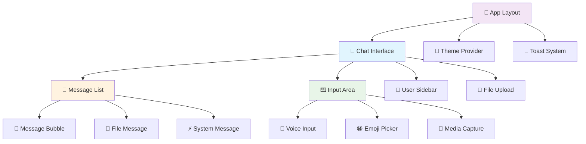

# 🎨 Chat Anónimo - Frontend

<div align="center">


**🌟 Interfaz moderna y responsive para chat anónimo seguro con cifrado end-to-end**

[🌐 **Demo en Vivo**](https://write-ghost.netlify.app) | [🚀 **Backend**](https://github.com/h3n-x/chat-backend) | [📖 **Docs Principales**](https://github.com/h3n-x/chat-anonimo)

**📍 Repository:** `https://github.com/h3n-x/chat-frontend.git`

</div>

---

## 📋 Tabla de Contenidos

- [🚀 Quick Start](#-quick-start)
- [✨ Características Principales](#-características-principales)
- [🏗️ Arquitectura](#️-arquitectura)
- [⚙️ Instalación Detallada](#️-instalación-detallada)
- [🔧 Configuración](#-configuración)
- [🧩 Componentes Principales](#-componentes-principales)
- [🎨 Sistema de Diseño](#-sistema-de-diseño)
- [📱 Responsive Design](#-responsive-design)
- [🔐 Seguridad en Frontend](#-seguridad-en-frontend)
- [🧪 Testing y Calidad](#-testing-y-calidad)
- [🚀 Deployment](#-deployment)
- [🛠️ Desarrollo](#️-desarrollo)
- [🔗 Enlaces y Recursos](#-enlaces-y-recursos)

---

## 🚀 Quick Start

### ⚡ **Setup en 30 segundos**

```bash
# 1️⃣ Clonar repositorio
git clone https://github.com/h3n-x/chat-frontend.git
cd chat-frontend

# 2️⃣ Instalar dependencias
npm install

# 3️⃣ Configurar variables de entorno
echo "NEXT_PUBLIC_WS_URL=wss://chat-backend-haeb.onrender.com" > .env.local
echo "NEXT_PUBLIC_API_URL=https://chat-backend-haeb.onrender.com" >> .env.local

# 4️⃣ Ejecutar en desarrollo
npm run dev

# 🎉 Abrir: http://localhost:3000
```

### 🎯 **Demo Instantáneo**

¿No quieres instalar nada? **[Prueba la demo en vivo →](https://write-ghost.netlify.app)**

---

## ✨ Características Principales

### 🎨 **Experiencia de Usuario**
- 🌙 **Modo Oscuro/Claro** - Detección automática del sistema
- 📱 **Totalmente Responsive** - Optimizado desde móviles hasta 4K
- ⚡ **Performance Optimizada** - Carga en < 2 segundos
- 🎭 **Animaciones Fluidas** - Transiciones suaves y profesionales
- 🔔 **Notificaciones Smart** - Sistema de alerts elegante
- 🎵 **Sonidos Opcionales** - Feedback auditivo para notificaciones

### 🔐 **Seguridad y Privacidad**
- 🔒 **Cifrado en Cliente** - AES-256-GCM procesado localmente
- 🔑 **Gestión Segura de Claves** - Claves nunca almacenadas persistentemente
- 🚫 **Zero Tracking** - Sin cookies, sin analytics, sin persistencia
- 🛡️ **Sanitización XSS** - Protección contra ataques de script
- 🌐 **HTTPS Forzado** - Todas las conexiones seguras

### 💬 **Funcionalidades de Chat**
- 📨 **Mensajes en Tiempo Real** - WebSocket con reconexión automática
- 📁 **Drag & Drop de Archivos** - Subida intuitiva hasta 15MB
- 🖼️ **Vista Previa de Imágenes** - Viewer integrado para multimedia
- 👥 **Lista de Usuarios Live** - Estado de conexión en tiempo real
- ✍️ **Indicador de Escritura** - Ver quién está escribiendo
- 🏠 **Salas Privadas** - Códigos únicos de 6 dígitos
- 📊 **Estado de Conexión** - Indicadores visuales claros

### 🎛️ **Tecnología Avanzada**
- ⚛️ **React 18** - Concurrent features y Suspense
- 🔷 **TypeScript Estricto** - Type safety completa
- 🏗️ **Next.js 14** - App Router y Server Components
- 💨 **TailwindCSS** - Utility-first styling
- 🎭 **Shadcn/UI** - Componentes accesibles y modernos
- 🔄 **SWR/React Query** - Data fetching optimizado

---

## 🏗️ Arquitectura

### 📦 **Estructura de Componentes**



### 🗂️ **Estructura de Directorios**

```
chat-frontend/
├── 📱 app/                    # Next.js 14 App Router
│   ├── 🏠 page.tsx           # Página principal
│   ├── 🎨 layout.tsx         # Layout raíz
│   ├── 🌐 globals.css        # Estilos globales
│   └── 🔧 not-found.tsx      # Página 404
├── 🧩 components/             # Componentes React
│   ├── 💬 chat/              # Componentes de chat
│   │   ├── interface.tsx     # Interfaz principal
│   │   ├── message.tsx       # Componente mensaje
│   │   ├── input.tsx         # Input de mensaje
│   │   └── user-list.tsx     # Lista usuarios
│   ├── 📁 file/              # Gestión de archivos
│   │   ├── upload.tsx        # Drag & drop
│   │   ├── preview.tsx       # Vista previa
│   │   └── progress.tsx      # Barra progreso
│   ├── 🏠 room/              # Gestión salas
│   │   ├── manager.tsx       # Crear/unirse
│   │   ├── list.tsx          # Lista salas
│   │   └── settings.tsx      # Configuración
│   ├── 🎭 ui/                # Componentes base UI
│   │   ├── button.tsx        # Botones
│   │   ├── input.tsx         # Inputs
│   │   ├── modal.tsx         # Modales
│   │   ├── toast.tsx         # Notificaciones
│   │   └── ...               # Más componentes
│   └── 🔔 notifications/     # Sistema notificaciones
├── 🔧 lib/                   # Utilidades y lógica
│   ├── 📡 api/               # Comunicación backend
│   │   ├── websocket.ts      # Gestión WebSocket
│   │   ├── http.ts           # Requests HTTP
│   │   └── types.ts          # Tipos TypeScript
│   ├── 🔐 crypto/            # Cifrado frontend
│   │   ├── aes.ts            # Implementación AES
│   │   ├── keys.ts           # Gestión claves
│   │   └── utils.ts          # Utilidades crypto
│   ├── 🛠️ utils/             # Utilidades generales
│   │   ├── format.ts         # Formateo datos
│   │   ├── validation.ts     # Validaciones
│   │   └── constants.ts      # Constantes
│   └── 🎨 styles/            # Configuración estilos
├── 📦 hooks/                 # Custom React Hooks
│   ├── 📱 use-mobile.ts      # Detección móvil
│   ├── 🔔 use-toast.ts       # Sistema toast
│   ├── 🌙 use-theme.ts       # Gestión tema
│   ├── 📡 use-websocket.ts   # WebSocket hook
│   └── 🔐 use-crypto.ts      # Cifrado hook
├── 🎯 public/                # Recursos estáticos
│   ├── 🖼️ images/            # Imágenes
│   ├── 🔊 sounds/            # Sonidos notificación
│   ├── 🎨 icons/             # Iconos SVG
│   └── 📄 manifest.json      # PWA manifest
├── 🧪 __tests__/             # Tests unitarios
├── 📊 .storybook/            # Storybook config
├── 🔧 config/                # Configuraciones
│   ├── tailwind.config.js    # TailwindCSS
│   ├── next.config.mjs       # Next.js
│   └── tsconfig.json         # TypeScript
└── 📦 package.json           # Dependencias
```

---

## ⚙️ Instalación Detallada

### 📋 **Requisitos del Sistema**

| Herramienta | Versión Mínima | Recomendada | Notas |
|-------------|----------------|-------------|--------|
| **Node.js** | 18.0.0 | 20.x LTS | Para mejor performance |
| **npm** | 8.0.0 | 10.x | O usar pnpm/yarn |
| **Git** | 2.20.0 | Latest | Para clonar repo |
| **OS** | - | macOS/Linux/Windows | Multiplataforma |

### 🛠️ **Proceso de Instalación Completo**

```bash
# 1️⃣ Verificar requisitos
node --version    # Debe ser >= 18.0.0
npm --version     # Debe ser >= 8.0.0

# 2️⃣ Clonar repositorio
git clone https://github.com/h3n-x/chat-frontend.git
cd chat-frontend

# 3️⃣ Instalar dependencias
npm install
# o usando pnpm (más rápido)
pnpm install
# o usando yarn
yarn install

# 4️⃣ Configurar variables de entorno
cp .env.example .env.local
# Editar .env.local con tus configuraciones

# 5️⃣ Ejecutar en desarrollo
npm run dev

# 6️⃣ Verificar instalación
# Abrir: http://localhost:3000
# Debería cargar la interfaz de chat
```

### 🔧 **Scripts Disponibles**

```bash
# 🏃 Desarrollo
npm run dev          # Servidor desarrollo con hot-reload
npm run dev:turbo    # Modo turbo (experimental)

# 🏗️ Build
npm run build        # Build para producción
npm run export       # Export estático para Netlify
npm run start        # Servidor producción local

# 🧪 Testing
npm run test         # Tests unitarios
npm run test:watch   # Tests en modo watch
npm run test:coverage # Coverage report
npm run e2e          # Tests end-to-end (Playwright)

# 📊 Code Quality
npm run lint         # ESLint
npm run lint:fix     # Auto-fix linting
npm run format       # Prettier
npm run type-check   # TypeScript check

# 📖 Documentación
npm run storybook    # Storybook server
npm run build-storybook # Build storybook

# 🔍 Análisis
npm run analyze      # Bundle analyzer
npm run lighthouse   # Performance audit
```

---

## 🔧 Configuración

### 🌍 **Variables de Entorno**

```bash
# .env.local (desarrollo)
NEXT_PUBLIC_WS_URL=ws://localhost:8000
NEXT_PUBLIC_API_URL=http://localhost:8000
NEXT_PUBLIC_APP_NAME="Chat Anónimo"
NEXT_PUBLIC_ENVIRONMENT=development
NEXT_PUBLIC_DEBUG=true

# .env.production (producción)
NEXT_PUBLIC_WS_URL=wss://chat-backend-haeb.onrender.com
NEXT_PUBLIC_API_URL=https://chat-backend-haeb.onrender.com
NEXT_PUBLIC_APP_NAME="Chat Anónimo"
NEXT_PUBLIC_ENVIRONMENT=production
NEXT_PUBLIC_DEBUG=false

# .env.test (testing)
NEXT_PUBLIC_WS_URL=ws://localhost:8001
NEXT_PUBLIC_API_URL=http://localhost:8001
NEXT_PUBLIC_ENVIRONMENT=test
```

### ⚙️ **Configuración Next.js**

```javascript
// next.config.mjs
/** @type {import('next').NextConfig} */
const nextConfig = {
  // 📦 Output estático para Netlify
  output: 'export',
  trailingSlash: true,
  
  // 🖼️ Optimización de imágenes
  images: {
    unoptimized: true,
    domains: ['chat-backend-haeb.onrender.com']
  },
  
  // 🔧 TypeScript
  typescript: {
    ignoreBuildErrors: false
  },
  
  // 📊 ESLint
  eslint: {
    ignoreDuringBuilds: false
  },
  
  // ⚡ Performance
  experimental: {
    optimizeCss: true,
    optimizePackageImports: ['@shadcn/ui', 'lucide-react']
  },
  
  // 🗜️ Compresión
  compress: true,
  
  // 🔒 Headers de seguridad
  async headers() {
    return [
      {
        source: '/(.*)',
        headers: [
          {
            key: 'X-Frame-Options',
            value: 'DENY'
          },
          {
            key: 'X-Content-Type-Options',
            value: 'nosniff'
          },
          {
            key: 'Referrer-Policy',
            value: 'origin-when-cross-origin'
          }
        ]
      }
    ]
  }
}

export default nextConfig
```

### 🎨 **Configuración TailwindCSS**

```javascript
// tailwind.config.js
/** @type {import('tailwindcss').Config} */
module.exports = {
  darkMode: 'class',
  content: [
    './pages/**/*.{js,ts,jsx,tsx,mdx}',
    './components/**/*.{js,ts,jsx,tsx,mdx}',
    './app/**/*.{js,ts,jsx,tsx,mdx}',
  ],
  theme: {
    extend: {
      colors: {
        // 🎨 Paleta personalizada
        primary: {
          50: '#eff6ff',
          500: '#3b82f6',
          900: '#1e3a8a',
        },
        // 🌙 Modo oscuro
        dark: {
          bg: '#0f0f23',
          surface: '#1a1a2e',
          border: '#16213e',
        }
      },
      // ⚡ Animaciones
      animation: {
        'fade-in': 'fadeIn 0.5s ease-in-out',
        'slide-up': 'slideUp 0.3s ease-out',
        'pulse-soft': 'pulseSoft 2s infinite',
      },
      // 📱 Breakpoints personalizados
      screens: {
        'xs': '475px',
        '3xl': '1600px',
      }
    },
  },
  plugins: [
    require('@tailwindcss/forms'),
    require('@tailwindcss/typography'),
    require('tailwindcss-animate'),
  ],
}
```

---

## 🧩 Componentes Principales

### 💬 **ChatInterface**

```tsx
// components/chat/interface.tsx
'use client'

import { useState, useEffect } from 'react'
import { useWebSocket } from '@/hooks/use-websocket'
import { useCrypto } from '@/hooks/use-crypto'

interface ChatInterfaceProps {
  roomId?: string
  isPrivate?: boolean
}

export function ChatInterface({ roomId = 'general', isPrivate = false }: ChatInterfaceProps) {
  const { messages, users, sendMessage, uploadFile, connected } = useWebSocket(roomId)
  const { encryptMessage, decryptMessage } = useCrypto(roomId)
  
  const handleSendMessage = async (content: string) => {
    if (!content.trim()) return
    
    const encrypted = await encryptMessage(content)
    await sendMessage(encrypted)
  }
  
  return (
    <div className="flex h-screen bg-background">
      {/* 📱 Layout responsive */}
      <div className="flex-1 flex flex-col">
        {/* 📊 Header con estado */}
        <ChatHeader 
          roomId={roomId}
          userCount={users.length}
          connected={connected}
        />
        
        {/* 💬 Lista de mensajes */}
        <MessageList 
          messages={messages}
          onDecrypt={decryptMessage}
          className="flex-1 overflow-y-auto"
        />
        
        {/* ⌨️ Input de mensaje */}
        <MessageInput 
          onSend={handleSendMessage}
          onFileUpload={uploadFile}
          disabled={!connected}
        />
      </div>
      
      {/* 👥 Sidebar de usuarios */}
      <UserSidebar 
        users={users}
        className="hidden md:block w-64 border-l"
      />
    </div>
  )
}
```

### 📁 **FileUpload Component**

```tsx
// components/file/upload.tsx
'use client'

import { useCallback } from 'react'
import { useDropzone } from 'react-dropzone'
import { Upload, File, X } from 'lucide-react'
import { toast } from '@/hooks/use-toast'

interface FileUploadProps {
  onUpload: (files: File[]) => Promise<void>
  maxSize?: number
  maxFiles?: number
  acceptedTypes?: string[]
}

export function FileUpload({ 
  onUpload, 
  maxSize = 15 * 1024 * 1024, // 15MB
  maxFiles = 5,
  acceptedTypes = ['image/*', 'application/pdf', 'text/*']
}: FileUploadProps) {
  
  const onDrop = useCallback(async (acceptedFiles: File[]) => {
    try {
      await onUpload(acceptedFiles)
      toast({
        title: "✅ Archivos subidos",
        description: `${acceptedFiles.length} archivo(s) compartido(s) exitosamente`,
      })
    } catch (error) {
      toast({
        title: "❌ Error al subir",
        description: "No se pudieron subir los archivos",
        variant: "destructive"
      })
    }
  }, [onUpload])

  const {
    getRootProps,
    getInputProps,
    isDragActive,
    isDragReject,
    fileRejections
  } = useDropzone({
    onDrop,
    maxSize,
    maxFiles,
    accept: acceptedTypes.reduce((acc, type) => {
      acc[type] = []
      return acc
    }, {} as Record<string, string[]>)
  })

  return (
    <div
      {...getRootProps()}
      className={`
        border-2 border-dashed rounded-lg p-6 text-center cursor-pointer
        transition-colors duration-200
        ${isDragActive ? 'border-primary bg-primary/10' : 'border-muted-foreground/25'}
        ${isDragReject ? 'border-destructive bg-destructive/10' : ''}
        hover:border-primary hover:bg-primary/5
      `}
    >
      <input {...getInputProps()} />
      
      <div className="flex flex-col items-center gap-2">
        <Upload className="h-8 w-8 text-muted-foreground" />
        
        {isDragActive ? (
          <p className="text-primary font-medium">
            📁 Suelta los archivos aquí...
          </p>
        ) : (
          <div>
            <p className="font-medium">
              📎 Arrastra archivos o haz clic para seleccionar
            </p>
            <p className="text-sm text-muted-foreground mt-1">
              Máximo {maxFiles} archivos de {(maxSize / 1024 / 1024).toFixed(0)}MB cada uno
            </p>
          </div>
        )}
      </div>
      
      {/* 🚨 Errores de validación */}
      {fileRejections.length > 0 && (
        <div className="mt-2 text-sm text-destructive">
          {fileRejections.map(({ file, errors }) => (
            <div key={file.name}>
              {errors.map(error => (
                <p key={error.code}>❌ {error.message}</p>
              ))}
            </div>
          ))}
        </div>
      )}
    </div>
  )
}
```

### 🔐 **Crypto Hook**

```tsx
// hooks/use-crypto.ts
'use client'

import { useState, useEffect, useCallback } from 'react'
import { generateRoomKey, encryptMessage, decryptMessage } from '@/lib/crypto'

export function useCrypto(roomId: string) {
  const [roomKey, setRoomKey] = useState<string | null>(null)
  const [isReady, setIsReady] = useState(false)

  // 🔑 Generar o recuperar clave de sala
  useEffect(() => {
    const initializeCrypto = async () => {
      try {
        // Para sala general, usar clave compartida
        if (roomId === 'general') {
          const key = generateRoomKey()
          setRoomKey(key)
        } else {
          // Para salas privadas, recibir clave del servidor
          const key = await requestRoomKey(roomId)
          setRoomKey(key)
        }
        setIsReady(true)
      } catch (error) {
        console.error('Error inicializando crypto:', error)
      }
    }

    initializeCrypto()
  }, [roomId])

  const encrypt = useCallback(async (message: string) => {
    if (!roomKey || !isReady) {
      throw new Error('Crypto no está listo')
    }
    
    return await encryptMessage(message, roomKey)
  }, [roomKey, isReady])

  const decrypt = useCallback(async (encryptedData: any) => {
    if (!roomKey || !isReady) {
      throw new Error('Crypto no está listo')
    }
    
    return await decryptMessage(encryptedData, roomKey)
  }, [roomKey, isReady])

  return {
    encryptMessage: encrypt,
    decryptMessage: decrypt,
    isReady,
    roomKey: roomKey ? '🔑 Configurado' : '⏳ Cargando...'
  }
}

async function requestRoomKey(roomId: string): Promise<string> {
  // Implementar solicitud de clave al servidor
  // Por ahora, generar clave local
  return generateRoomKey()
}
```

---

## 🎨 Sistema de Diseño

### 🌈 **Paleta de Colores**

```css
/* globals.css */
:root {
  /* 🌞 Modo claro */
  --background: 0 0% 100%;
  --foreground: 222.2 84% 4.9%;
  --primary: 221.2 83.2% 53.3%;
  --primary-foreground: 210 40% 98%;
  --secondary: 210 40% 96%;
  --secondary-foreground: 222.2 84% 4.9%;
  --muted: 210 40% 96%;
  --muted-foreground: 215.4 16.3% 46.9%;
  --accent: 210 40% 96%;
  --accent-foreground: 222.2 84% 4.9%;
  --destructive: 0 84.2% 60.2%;
  --destructive-foreground: 210 40% 98%;
  --border: 214.3 31.8% 91.4%;
  --input: 214.3 31.8% 91.4%;
  --ring: 221.2 83.2% 53.3%;
  --radius: 0.5rem;
}

.dark {
  /* 🌙 Modo oscuro */
  --background: 222.2 84% 4.9%;
  --foreground: 210 40% 98%;
  --primary: 217.2 91.2% 59.8%;
  --primary-foreground: 222.2 84% 4.9%;
  --secondary: 217.2 32.6% 17.5%;
  --secondary-foreground: 210 40% 98%;
  --muted: 217.2 32.6% 17.5%;
  --muted-foreground: 215 20.2% 65.1%;
  --accent: 217.2 32.6% 17.5%;
  --accent-foreground: 210 40% 98%;
  --destructive: 0 62.8% 30.6%;
  --destructive-foreground: 210 40% 98%;
  --border: 217.2 32.6% 17.5%;
  --input: 217.2 32.6% 17.5%;
  --ring: 224.3 76.3% 94.1%;
}
```

### 🎭 **Componentes de UI Base**

```tsx
// components/ui/button.tsx
import { cn } from '@/lib/utils'
import { cva, type VariantProps } from 'class-variance-authority'

const buttonVariants = cva(
  "inline-flex items-center justify-center rounded-md text-sm font-medium ring-offset-background transition-colors focus-visible:outline-none focus-visible:ring-2 focus-visible:ring-ring focus-visible:ring-offset-2 disabled:pointer-events-none disabled:opacity-50",
  {
    variants: {
      variant: {
        default: "bg-primary text-primary-foreground hover:bg-primary/90",
        destructive: "bg-destructive text-destructive-foreground hover:bg-destructive/90",
        outline: "border border-input bg-background hover:bg-accent hover:text-accent-foreground",
        secondary: "bg-secondary text-secondary-foreground hover:bg-secondary/80",
        ghost: "hover:bg-accent hover:text-accent-foreground",
        link: "text-primary underline-offset-4 hover:underline",
      },
      size: {
        default: "h-10 px-4 py-2",
        sm: "h-9 rounded-md px-3",
        lg: "h-11 rounded-md px-8",
        icon: "h-10 w-10",
      },
    },
    defaultVariants: {
      variant: "default",
      size: "default",
    },
  }
)

interface ButtonProps extends React.ButtonHTMLAttributes<HTMLButtonElement>, VariantProps<typeof buttonVariants> {}

export function Button({ className, variant, size, ...props }: ButtonProps) {
  return (
    <button
      className={cn(buttonVariants({ variant, size, className }))}
      {...props}
    />
  )
}
```

---

## 📱 Responsive Design

### 📊 **Breakpoints y Estrategia**

```typescript
// lib/responsive.ts
export const breakpoints = {
  xs: '475px',    // 📱 Teléfonos pequeños
  sm: '640px',    // 📱 Teléfonos
  md: '768px',    // 📱 Tablets
  lg: '1024px',   // 💻 Laptops
  xl: '1280px',   // 🖥️ Desktops
  '2xl': '1536px', // 🖥️ Monitores grandes
  '3xl': '1600px'  // 🖥️ Ultra wide
} as const

export const queries = {
  mobile: `(max-width: ${breakpoints.md})`,
  tablet: `(min-width: ${breakpoints.md}) and (max-width: ${breakpoints.lg})`,
  desktop: `(min-width: ${breakpoints.lg})`,
  touch: '(hover: none) and (pointer: coarse)',
  mouse: '(hover: hover) and (pointer: fine)'
} as const
```

### 📱 **Hook de Detección de Dispositivo**

```tsx
// hooks/use-device.ts
'use client'

import { useState, useEffect } from 'react'

interface DeviceInfo {
  isMobile: boolean
  isTablet: boolean
  isDesktop: boolean
  isTouch: boolean
  orientation: 'portrait' | 'landscape'
  screenSize: 'xs' | 'sm' | 'md' | 'lg' | 'xl' | '2xl' | '3xl'
}

export function useDevice(): DeviceInfo {
  const [deviceInfo, setDeviceInfo] = useState<DeviceInfo>({
    isMobile: false,
    isTablet: false,
    isDesktop: true,
    isTouch: false,
    orientation: 'landscape',
    screenSize: 'lg'
  })

  useEffect(() => {
    const updateDeviceInfo = () => {
      const width = window.innerWidth
      const height = window.innerHeight
      
      setDeviceInfo({
        isMobile: width < 768,
        isTablet: width >= 768 && width < 1024,
        isDesktop: width >= 1024,
        isTouch: 'ontouchstart' in window,
        orientation: height > width ? 'portrait' : 'landscape',
        screenSize: getScreenSize(width)
      })
    }

    updateDeviceInfo()
    window.addEventListener('resize', updateDeviceInfo)
    window.addEventListener('orientationchange', updateDeviceInfo)

    return () => {
      window.removeEventListener('resize', updateDeviceInfo)
      window.removeEventListener('orientationchange', updateDeviceInfo)
    }
  }, [])

  return deviceInfo
}

function getScreenSize(width: number): DeviceInfo['screenSize'] {
  if (width < 475) return 'xs'
  if (width < 640) return 'sm'
  if (width < 768) return 'md'
  if (width < 1024) return 'lg'
  if (width < 1280) return 'xl'
  if (width < 1536) return '2xl'
  return '3xl'
}
```

---

## 🔐 Seguridad en Frontend

### 🛡️ **Implementación de Cifrado**

```typescript
// lib/crypto/aes.ts
export class AESCrypto {
  private static async generateKey(): Promise<CryptoKey> {
    return await crypto.subtle.generateKey(
      {
        name: 'AES-GCM',
        length: 256
      },
      true,
      ['encrypt', 'decrypt']
    )
  }

  static async encrypt(
    data: string, 
    key: string
  ): Promise<{ data: string; nonce: string; algorithm: string }> {
    const encoder = new TextEncoder()
    const dataBuffer = encoder.encode(data)
    
    // 🔑 Importar clave
    const cryptoKey = await this.importKey(key)
    
    // 🎲 Generar nonce único
    const nonce = crypto.getRandomValues(new Uint8Array(12))
    
    // 🔒 Cifrar datos
    const encrypted = await crypto.subtle.encrypt(
      { name: 'AES-GCM', iv: nonce },
      cryptoKey,
      dataBuffer
    )
    
    return {
      data: this.arrayBufferToBase64(encrypted),
      nonce: this.arrayBufferToBase64(nonce),
      algorithm: 'AES-256-GCM'
    }
  }

  static async decrypt(
    encryptedData: { data: string; nonce: string }, 
    key: string
  ): Promise<string> {
    const cryptoKey = await this.importKey(key)
    const data = this.base64ToArrayBuffer(encryptedData.data)
    const nonce = this.base64ToArrayBuffer(encryptedData.nonce)
    
    const decrypted = await crypto.subtle.decrypt(
      { name: 'AES-GCM', iv: nonce },
      cryptoKey,
      data
    )
    
    const decoder = new TextDecoder()
    return decoder.decode(decrypted)
  }

  private static async importKey(keyString: string): Promise<CryptoKey> {
    const keyBuffer = this.base64ToArrayBuffer(keyString)
    return await crypto.subtle.importKey(
      'raw',
      keyBuffer,
      { name: 'AES-GCM' },
      false,
      ['encrypt', 'decrypt']
    )
  }

  private static arrayBufferToBase64(buffer: ArrayBuffer): string {
    const bytes = new Uint8Array(buffer)
    const binary = Array.from(bytes, byte => String.fromCharCode(byte)).join('')
    return btoa(binary)
  }

  private static base64ToArrayBuffer(base64: string): ArrayBuffer {
    const binary = atob(base64)
    const bytes = new Uint8Array(binary.length)
    for (let i = 0; i < binary.length; i++) {
      bytes[i] = binary.charCodeAt(i)
    }
    return bytes.buffer
  }
}
```

### 🔒 **Sanitización y Validación**

```typescript
// lib/security/sanitize.ts
import DOMPurify from 'dompurify'

export class SecurityUtils {
  // 🧹 Sanitizar HTML
  static sanitizeHtml(html: string): string {
    return DOMPurify.sanitize(html, {
      ALLOWED_TAGS: ['b', 'i', 'em', 'strong', 'u'],
      ALLOWED_ATTR: []
    })
  }

  // 🔍 Validar URL
  static isValidUrl(url: string): boolean {
    try {
      const parsedUrl = new URL(url)
      return ['http:', 'https:'].includes(parsedUrl.protocol)
    } catch {
      return false
    }
  }

  // 📧 Validar entrada de mensaje
  static validateMessage(message: string): {
    isValid: boolean
    errors: string[]
  } {
    const errors: string[] = []
    
    if (!message || message.trim().length === 0) {
      errors.push('El mensaje no puede estar vacío')
    }
    
    if (message.length > 1000) {
      errors.push('El mensaje no puede exceder 1000 caracteres')
    }
    
    // 🚫 Detectar patrones maliciosos
    const maliciousPatterns = [
      /<script/i,
      /javascript:/i,
      /data:text\/html/i,
      /vbscript:/i
    ]
    
    for (const pattern of maliciousPatterns) {
      if (pattern.test(message)) {
        errors.push('Contenido no permitido detectado')
        break
      }
    }
    
    return {
      isValid: errors.length === 0,
      errors
    }
  }

  // 📁 Validar archivo
  static validateFile(file: File): {
    isValid: boolean
    errors: string[]
  } {
    const errors: string[] = []
    const maxSize = 15 * 1024 * 1024 // 15MB
    
    const allowedTypes = [
      'image/jpeg', 'image/png', 'image/gif', 'image/webp',
      'application/pdf', 'text/plain', 'text/markdown',
      'application/msword', 'application/vnd.openxmlformats-officedocument.wordprocessingml.document'
    ]
    
    if (file.size > maxSize) {
      errors.push(`El archivo excede el tamaño máximo de ${maxSize / 1024 / 1024}MB`)
    }
    
    if (!allowedTypes.includes(file.type)) {
      errors.push('Tipo de archivo no permitido')
    }
    
    // 🔍 Verificar extensión
    const extension = file.name.split('.').pop()?.toLowerCase()
    const allowedExtensions = ['jpg', 'jpeg', 'png', 'gif', 'webp', 'pdf', 'txt', 'md', 'doc', 'docx']
    
    if (!extension || !allowedExtensions.includes(extension)) {
      errors.push('Extensión de archivo no válida')
    }
    
    return {
      isValid: errors.length === 0,
      errors
    }
  }
}
```

---

## 🧪 Testing y Calidad

### 🔬 **Configuración de Testing**

```typescript
// jest.config.js
const nextJest = require('next/jest')

const createJestConfig = nextJest({
  dir: './',
})

const customJestConfig = {
  setupFilesAfterEnv: ['<rootDir>/jest.setup.js'],
  moduleNameMapping: {
    '^@/(.*)$': '<rootDir>/$1',
  },
  testEnvironment: 'jest-environment-jsdom',
  collectCoverageFrom: [
    'components/**/*.{js,jsx,ts,tsx}',
    'lib/**/*.{js,jsx,ts,tsx}',
    'hooks/**/*.{js,jsx,ts,tsx}',
    '!**/*.d.ts',
    '!**/node_modules/**',
  ],
  coverageThreshold: {
    global: {
      branches: 80,
      functions: 80,
      lines: 80,
      statements: 80,
    },
  },
}

module.exports = createJestConfig(customJestConfig)
```

### 🧪 **Tests de Ejemplo**

```typescript
// __tests__/components/chat-message.test.tsx
import { render, screen } from '@testing-library/react'
import { ChatMessage } from '@/components/chat/message'

describe('ChatMessage', () => {
  const mockMessage = {
    id: '1',
    content: 'Hola mundo',
    username: 'TestUser',
    timestamp: '2024-01-01T00:00:00Z',
    userId: 'user123'
  }

  it('renders message content correctly', () => {
    render(<ChatMessage message={mockMessage} />)
    
    expect(screen.getByText('Hola mundo')).toBeInTheDocument()
    expect(screen.getByText('TestUser')).toBeInTheDocument()
  })

  it('shows timestamp in correct format', () => {
    render(<ChatMessage message={mockMessage} />)
    
    // Verificar que el timestamp se muestra
    expect(screen.getByText(/00:00/)).toBeInTheDocument()
  })

  it('applies correct styling for own messages', () => {
    render(<ChatMessage message={mockMessage} isOwnMessage={true} />)
    
    const messageElement = screen.getByTestId('chat-message')
    expect(messageElement).toHaveClass('ml-auto')
  })
})
```

### 📊 **E2E Testing con Playwright**

```typescript
// e2e/chat.spec.ts
import { test, expect } from '@playwright/test'

test.describe('Chat Functionality', () => {
  test.beforeEach(async ({ page }) => {
    await page.goto('http://localhost:3000')
  })

  test('should connect to chat and send message', async ({ page }) => {
    // 🔍 Verificar conexión
    await expect(page.locator('[data-testid="connection-status"]')).toContainText('Conectado')
    
    // ✍️ Enviar mensaje
    const messageInput = page.locator('[data-testid="message-input"]')
    await messageInput.fill('Hola desde Playwright!')
    await messageInput.press('Enter')
    
    // ✅ Verificar que el mensaje aparece
    await expect(page.locator('[data-testid="message-list"]')).toContainText('Hola desde Playwright!')
  })

  test('should upload file successfully', async ({ page }) => {
    // 📁 Subir archivo
    const fileInput = page.locator('input[type="file"]')
    await fileInput.setInputFiles('test-files/sample.png')
    
    // ✅ Verificar que el archivo se muestra
    await expect(page.locator('[data-testid="file-message"]')).toBeVisible()
  })

  test('should switch between light and dark mode', async ({ page }) => {
    // 🌙 Cambiar a modo oscuro
    await page.click('[data-testid="theme-toggle"]')
    await expect(page.locator('html')).toHaveClass(/dark/)
    
    // ☀️ Cambiar a modo claro
    await page.click('[data-testid="theme-toggle"]')
    await expect(page.locator('html')).not.toHaveClass(/dark/)
  })
})
```

---

## 🚀 Deployment

### 🌐 **Netlify Deployment**

```toml
# netlify.toml
[build]
  command = "npm run build"
  publish = "out"

[build.environment]
  NEXT_PUBLIC_WS_URL = "wss://chat-backend-haeb.onrender.com"
  NEXT_PUBLIC_API_URL = "https://chat-backend-haeb.onrender.com"
  NEXT_PUBLIC_APP_NAME = "Chat Anónimo"
  NEXT_PUBLIC_ENVIRONMENT = "production"

[[redirects]]
  from = "/*"
  to = "/index.html"
  status = 200

[context.deploy-preview]
  command = "npm run build"
  [context.deploy-preview.environment]
    NEXT_PUBLIC_WS_URL = "wss://staging-backend.herokuapp.com"

[context.branch-deploy]
  command = "npm run build"

# 🔒 Headers de seguridad
[[headers]]
  for = "/*"
  [headers.values]
    X-Frame-Options = "DENY"
    X-Content-Type-Options = "nosniff"
    Referrer-Policy = "origin-when-cross-origin"
    Permissions-Policy = "camera=(), microphone=(), geolocation=()"
```

### 🚀 **Deploy con GitHub Actions**

```yaml
# .github/workflows/deploy.yml
name: Deploy Frontend to Netlify

on:
  push:
    branches: [main]
  pull_request:
    branches: [main]

jobs:
  build-and-deploy:
    runs-on: ubuntu-latest
    
    steps:
      - name: 📥 Checkout
        uses: actions/checkout@v4
        
      - name: 📦 Setup Node.js
        uses: actions/setup-node@v4
        with:
          node-version: '20'
          cache: 'npm'
          
      - name: 📚 Install dependencies
        run: npm ci
        
      - name: 🧪 Run tests
        run: npm run test
        
      - name: 📊 Run linting
        run: npm run lint
        
      - name: 🔍 Type check
        run: npm run type-check
        
      - name: 🏗️ Build
        run: npm run build
        env:
          NEXT_PUBLIC_WS_URL: ${{ secrets.NEXT_PUBLIC_WS_URL }}
          NEXT_PUBLIC_API_URL: ${{ secrets.NEXT_PUBLIC_API_URL }}
          
      - name: 🚀 Deploy to Netlify
        uses: nwtgck/actions-netlify@v2.0
        with:
          publish-dir: './out'
          production-branch: main
          github-token: ${{ secrets.GITHUB_TOKEN }}
          deploy-message: "Deploy from GitHub Actions"
        env:
          NETLIFY_AUTH_TOKEN: ${{ secrets.NETLIFY_AUTH_TOKEN }}
          NETLIFY_SITE_ID: ${{ secrets.NETLIFY_SITE_ID }}
```

---

## 🛠️ Desarrollo

### 🔧 **Environment Setup para Desarrollo**

```bash
# 1️⃣ Setup inicial completo
git clone https://github.com/h3n-x/chat-frontend.git
cd chat-frontend

# 2️⃣ Instalar herramientas globales
npm install -g @playwright/test

# 3️⃣ Setup del proyecto
npm install
npm run setup  # Script personalizado para configuración

# 4️⃣ Configurar Git hooks
npm run prepare  # Instala husky para pre-commit hooks

# 5️⃣ Configurar VSCode (opcional)
code .vscode/settings.json  # Configuraciones recomendadas
```

### 📝 **Scripts de Desarrollo Útiles**

```json
{
  "scripts": {
    "setup": "npm install && npm run prepare",
    "dev:debug": "NODE_OPTIONS='--inspect' npm run dev",
    "dev:https": "npm run dev --experimental-https",
    "test:ui": "npm run test -- --watch",
    "test:debug": "node --inspect-brk node_modules/.bin/jest --runInBand",
    "clean": "rm -rf .next out node_modules/.cache",
    "deps:update": "npx npm-check-updates -u && npm install",
    "deps:audit": "npm audit && npm run deps:check",
    "deps:check": "npx depcheck",
    "performance": "npm run build && npx lighthouse http://localhost:3000 --view",
    "bundle:analyze": "ANALYZE=true npm run build"
  }
}
```

### 🔍 **VSCode Configuration**

```json
// .vscode/settings.json
{
  "typescript.preferences.importModuleSpecifier": "relative",
  "editor.formatOnSave": true,
  "editor.defaultFormatter": "esbenp.prettier-vscode",
  "editor.codeActionsOnSave": {
    "source.fixAll.eslint": true,
    "source.organizeImports": true
  },
  "emmet.includeLanguages": {
    "typescript": "html",
    "typescriptreact": "html"
  },
  "files.associations": {
    "*.css": "tailwindcss"
  },
  "tailwindCSS.experimental.classRegex": [
    ["cn\\(([^)]*)\\)", "[\"'`]([^\"'`]*).*?[\"'`]"]
  ]
}
```

---

## 🔗 Enlaces y Recursos

### 📚 **Documentación y Referencias**
- 🏠 **[Documentación Principal](https://github.com/h3n-x/chat-anonimo)** - Overview completo del proyecto
- 🚀 **[Backend Repository](https://github.com/h3n-x/chat-backend)** - API y servidor FastAPI
- 📖 **[Next.js Docs](https://nextjs.org/docs)** - Documentación oficial de Next.js
- ⚛️ **[React Docs](https://react.dev)** - Documentación oficial de React
- 💨 **[TailwindCSS Docs](https://tailwindcss.com/docs)** - Documentación de TailwindCSS
- 🎭 **[Shadcn/UI](https://ui.shadcn.com)** - Componentes de UI

### 🤝 **Contribución y Comunidad**
- 🐛 **[Issues](https://github.com/h3n-x/chat-frontend/issues)** - Reportar bugs o solicitar features
- 💬 **[Discussions](https://github.com/h3n-x/chat-frontend/discussions)** - Preguntas y discusiones
- 📋 **[Project Board](https://github.com/h3n-x/chat-frontend/projects)** - Roadmap y tareas
- 🔄 **[Pull Requests](https://github.com/h3n-x/chat-frontend/pulls)** - Contribuciones pendientes

### 🚀 **Deployment y Monitoreo**
- 🌐 **[Frontend Live](https://write-ghost.netlify.app)** - Aplicación en producción
- 📊 **[Netlify Dashboard](https://app.netlify.com/sites/write-ghost)** - Panel de control de deployment
- 🔍 **[Lighthouse Report](https://pagespeed.web.dev/analysis/https-write-ghost-netlify-app)** - Análisis de performance
- 📈 **[Bundle Analyzer](https://bundlephobia.com)** - Análisis de tamaño de bundle

### 🛠️ **Herramientas de Desarrollo**
- 📖 **[Storybook](http://localhost:6006)** - Catálogo de componentes (modo dev)
- 🧪 **[Testing Playground](https://testing-playground.com)** - Selector de elementos para tests
- 🎨 **[Tailwind Play](https://play.tailwindcss.com)** - Playground para Tailwind
- 🔧 **[TypeScript Playground](https://www.typescriptlang.org/play)** - Playground para TypeScript

### 📊 **Performance y Analytics**
- ⚡ **[Web Vitals](https://web.dev/vitals)** - Métricas de performance web
- 🔍 **[Lighthouse](https://developers.google.com/web/tools/lighthouse)** - Auditoría de calidad web
- 📈 **[Core Web Vitals](https://pagespeed.web.dev)** - Análisis de métricas vitales

---

<div align="center">

## 🎉 ¡Gracias por usar Chat Anónimo Frontend!

**Interfaz moderna, segura y privada para comunicación anónima**

🌟 **[Prueba la Demo](https://write-ghost.netlify.app)** | 🤝 **[Contribuir](https://github.com/h3n-x/chat-frontend/issues)** | 📖 **[Documentación](https://github.com/h3n-x/chat-anonimo)**

---

**Made with ❤️ for privacy, security, and great user experience**


[⬆️ Volver al inicio](#-chat-anónimo---frontend)

</div>
