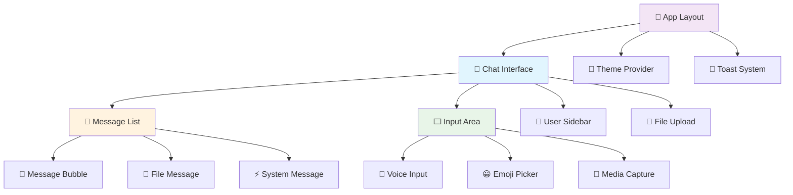

<div align="center">

# 🎨 Chat Anónimo - Frontend

<div align="center">


**🌟 Interfaz moderna y responsive para chat anónimo seguro con cifrado end-to-end**

[🌐 **Demo en Vivo**](https://write-ghost.netlify.app) | [🚀 **Backend**](https://github.com/h3n-x/chat-backend) | [📖 **Docs Principales**](https://github.com/h3n-x/chat-anonimo)

**📍 Repository:** `https://github.com/h3n-x/chat-frontend.git`

</div>

---

## 📋 Tabla de Contenidos

- [🚀 Quick Start](#-quick-start)
- [✨ Características Principales](#-características-principales)
- [🏗️ Arquitectura](#️-arquitectura)
- [⚙️ Instalación Detallada](#️-instalación-detallada)
- [🔧 Configuración](#-configuración)
- [🧩 Componentes Principales](#-componentes-principales)
- [🎨 Sistema de Diseño](#-sistema-de-diseño)
- [📱 Responsive Design](#-responsive-design)
- [🔐 Seguridad en Frontend](#-seguridad-en-frontend)
- [🧪 Testing y Calidad](#-testing-y-calidad)
- [🚀 Deployment](#-deployment)
- [🛠️ Desarrollo](#️-desarrollo)
- [🔗 Enlaces y Recursos](#-enlaces-y-recursos)

---

## 🚀 Quick Start

### ⚡ **Setup en 30 segundos**

```bash
# 1️⃣ Clonar repositorio
git clone https://github.com/h3n-x/chat-frontend.git
cd chat-frontend

# 2️⃣ Instalar dependencias
npm install

# 3️⃣ Configurar variables de entorno
echo "NEXT_PUBLIC_WS_URL=wss://chat-backend-haeb.onrender.com" > .env.local
echo "NEXT_PUBLIC_API_URL=https://chat-backend-haeb.onrender.com" >> .env.local

# 4️⃣ Ejecutar en desarrollo
npm run dev

# 🎉 Abrir: http://localhost:3000
```

### 🎯 **Demo Instantáneo**

¿No quieres instalar nada? **[Prueba la demo en vivo →](https://write-ghost.netlify.app)**

---

## ✨ Características Principales

### 🎨 **Experiencia de Usuario**
- 🌙 **Modo Oscuro/Claro** - Detección automática del sistema
- 📱 **Totalmente Responsive** - Optimizado desde móviles hasta 4K
- ⚡ **Performance Optimizada** - Carga en < 2 segundos
- 🎭 **Animaciones Fluidas** - Transiciones suaves y profesionales
- 🔔 **Notificaciones Smart** - Sistema de alerts elegante
- 🎵 **Sonidos Opcionales** - Feedback auditivo para notificaciones

### 🔐 **Seguridad y Privacidad**
- 🔒 **Cifrado en Cliente** - AES-256-GCM procesado localmente
- 🔑 **Gestión Segura de Claves** - Claves nunca almacenadas persistentemente
- 🚫 **Zero Tracking** - Sin cookies, sin analytics, sin persistencia
- 🛡️ **Sanitización XSS** - Protección contra ataques de script
- 🌐 **HTTPS Forzado** - Todas las conexiones seguras

### 💬 **Funcionalidades de Chat**
- 📨 **Mensajes en Tiempo Real** - WebSocket con reconexión automática
- 📁 **Drag & Drop de Archivos** - Subida intuitiva hasta 15MB
- 🖼️ **Vista Previa de Imágenes** - Viewer integrado para multimedia
- 👥 **Lista de Usuarios Live** - Estado de conexión en tiempo real
- ✍️ **Indicador de Escritura** - Ver quién está escribiendo
- 🏠 **Salas Privadas** - Códigos únicos de 6 dígitos
- 📊 **Estado de Conexión** - Indicadores visuales claros

### 🎛️ **Tecnología Avanzada**
- ⚛️ **React 18** - Concurrent features y Suspense
- 🔷 **TypeScript Estricto** - Type safety completa
- 🏗️ **Next.js 14** - App Router y Server Components
- 💨 **TailwindCSS** - Utility-first styling
- 🎭 **Shadcn/UI** - Componentes accesibles y modernos
- 🔄 **SWR/React Query** - Data fetching optimizado

---

## 🏗️ Arquitectura

### 📦 **Estructura de Componentes**



### 🗂️ **Estructura de Directorios**

```
chat-frontend/
├── 📱 app/                    # Next.js 14 App Router
│   ├── 🏠 page.tsx           # Página principal
│   ├── 🎨 layout.tsx         # Layout raíz
│   ├── 🌐 globals.css        # Estilos globales
│   └── 🔧 not-found.tsx      # Página 404
├── 🧩 components/             # Componentes React
│   ├── 💬 chat/              # Componentes de chat
│   │   ├── interface.tsx     # Interfaz principal
│   │   ├── message.tsx       # Componente mensaje
│   │   ├── input.tsx         # Input de mensaje
│   │   └── user-list.tsx     # Lista usuarios
│   ├── 📁 file/              # Gestión de archivos
│   │   ├── upload.tsx        # Drag & drop
│   │   ├── preview.tsx       # Vista previa
│   │   └── progress.tsx      # Barra progreso
│   ├── 🏠 room/              # Gestión salas
│   │   ├── manager.tsx       # Crear/unirse
│   │   ├── list.tsx          # Lista salas
│   │   └── settings.tsx      # Configuración
│   ├── 🎭 ui/                # Componentes base UI
│   │   ├── button.tsx        # Botones
│   │   ├── input.tsx         # Inputs
│   │   ├── modal.tsx         # Modales
│   │   ├── toast.tsx         # Notificaciones
│   │   └── ...               # Más componentes
│   └── 🔔 notifications/     # Sistema notificaciones
├── 🔧 lib/                   # Utilidades y lógica
│   ├── 📡 api/               # Comunicación backend
│   │   ├── websocket.ts      # Gestión WebSocket
│   │   ├── http.ts           # Requests HTTP
│   │   └── types.ts          # Tipos TypeScript
│   ├── 🔐 crypto/            # Cifrado frontend
│   │   ├── aes.ts            # Implementación AES
│   │   ├── keys.ts           # Gestión claves
│   │   └── utils.ts          # Utilidades crypto
│   ├── 🛠️ utils/             # Utilidades generales
│   │   ├── format.ts         # Formateo datos
│   │   ├── validation.ts     # Validaciones
│   │   └── constants.ts      # Constantes
│   └── 🎨 styles/            # Configuración estilos
├── 📦 hooks/                 # Custom React Hooks
│   ├── 📱 use-mobile.ts      # Detección móvil
│   ├── 🔔 use-toast.ts       # Sistema toast
│   ├── 🌙 use-theme.ts       # Gestión tema
│   ├── 📡 use-websocket.ts   # WebSocket hook
│   └── 🔐 use-crypto.ts      # Cifrado hook
├── 🎯 public/                # Recursos estáticos
│   ├── 🖼️ images/            # Imágenes
│   ├── 🔊 sounds/            # Sonidos notificación
│   ├── 🎨 icons/             # Iconos SVG
│   └── 📄 manifest.json      # PWA manifest
├── 🧪 __tests__/             # Tests unitarios
├── 📊 .storybook/            # Storybook config
├── 🔧 config/                # Configuraciones
│   ├── tailwind.config.js    # TailwindCSS
│   ├── next.config.mjs       # Next.js
│   └── tsconfig.json         # TypeScript
└── 📦 package.json           # Dependencias
```

---

## ⚙️ Instalación Detallada

### 📋 **Requisitos del Sistema**

| Herramienta | Versión Mínima | Recomendada | Notas |
|-------------|----------------|-------------|--------|
| **Node.js** | 18.0.0 | 20.x LTS | Para mejor performance |
| **npm** | 8.0.0 | 10.x | O usar pnpm/yarn |
| **Git** | 2.20.0 | Latest | Para clonar repo |
| **OS** | - | macOS/Linux/Windows | Multiplataforma |

### 🛠️ **Proceso de Instalación Completo**

```bash
# 1️⃣ Verificar requisitos
node --version    # Debe ser >= 18.0.0
npm --version     # Debe ser >= 8.0.0

# 2️⃣ Clonar repositorio
git clone https://github.com/h3n-x/chat-frontend.git
cd chat-frontend

# 3️⃣ Instalar dependencias
npm install
# o usando pnpm (más rápido)
pnpm install
# o usando yarn
yarn install

# 4️⃣ Configurar variables de entorno
cp .env.example .env.local
# Editar .env.local con tus configuraciones

# 5️⃣ Ejecutar en desarrollo
npm run dev

# 6️⃣ Verificar instalación
# Abrir: http://localhost:3000
# Debería cargar la interfaz de chat
```

### 🔧 **Scripts Disponibles**

```bash
# 🏃 Desarrollo
npm run dev          # Servidor desarrollo con hot-reload
npm run dev:turbo    # Modo turbo (experimental)

# 🏗️ Build
npm run build        # Build para producción
npm run export       # Export estático para Netlify
npm run start        # Servidor producción local

# 🧪 Testing
npm run test         # Tests unitarios
npm run test:watch   # Tests en modo watch
npm run test:coverage # Coverage report
npm run e2e          # Tests end-to-end (Playwright)

# 📊 Code Quality
npm run lint         # ESLint
npm run lint:fix     # Auto-fix linting
npm run format       # Prettier
npm run type-check   # TypeScript check

# 📖 Documentación
npm run storybook    # Storybook server
npm run build-storybook # Build storybook

# 🔍 Análisis
npm run analyze      # Bundle analyzer
npm run lighthouse   # Performance audit
```

---

## 🎨 Sistema de Diseño

### 🌈 **Paleta de Colores**

```css
/* globals.css */
:root {
  /* 🌞 Modo claro */
  --background: 0 0% 100%;
  --foreground: 222.2 84% 4.9%;
  --primary: 221.2 83.2% 53.3%;
  --primary-foreground: 210 40% 98%;
  --secondary: 210 40% 96%;
  --secondary-foreground: 222.2 84% 4.9%;
  --muted: 210 40% 96%;
  --muted-foreground: 215.4 16.3% 46.9%;
  --accent: 210 40% 96%;
  --accent-foreground: 222.2 84% 4.9%;
  --destructive: 0 84.2% 60.2%;
  --destructive-foreground: 210 40% 98%;
  --border: 214.3 31.8% 91.4%;
  --input: 214.3 31.8% 91.4%;
  --ring: 221.2 83.2% 53.3%;
  --radius: 0.5rem;
}

.dark {
  /* 🌙 Modo oscuro */
  --background: 222.2 84% 4.9%;
  --foreground: 210 40% 98%;
  --primary: 217.2 91.2% 59.8%;
  --primary-foreground: 222.2 84% 4.9%;
  --secondary: 217.2 32.6% 17.5%;
  --secondary-foreground: 210 40% 98%;
  --muted: 217.2 32.6% 17.5%;
  --muted-foreground: 215 20.2% 65.1%;
  --accent: 217.2 32.6% 17.5%;
  --accent-foreground: 210 40% 98%;
  --destructive: 0 62.8% 30.6%;
  --destructive-foreground: 210 40% 98%;
  --border: 217.2 32.6% 17.5%;
  --input: 217.2 32.6% 17.5%;
  --ring: 224.3 76.3% 94.1%;
}
```
---

## 🛠️ Desarrollo

### 🔧 **Environment Setup para Desarrollo**

```bash
# 1️⃣ Setup inicial completo
git clone https://github.com/h3n-x/chat-frontend.git
cd chat-frontend

# 2️⃣ Instalar herramientas globales
npm install -g @playwright/test

# 3️⃣ Setup del proyecto
npm install
npm run setup  # Script personalizado para configuración

# 4️⃣ Configurar Git hooks
npm run prepare  # Instala husky para pre-commit hooks
```

---

## 🔗 Enlaces y Recursos

### 📚 **Documentación y Referencias**
- 🏠 **[Documentación Principal](https://github.com/h3n-x/chat-anonimo)** - Overview completo del proyecto
- 🚀 **[Backend Repository](https://github.com/h3n-x/chat-backend)** - API y servidor FastAPI
- 📖 **[Next.js Docs](https://nextjs.org/docs)** - Documentación oficial de Next.js
- ⚛️ **[React Docs](https://react.dev)** - Documentación oficial de React
- 💨 **[TailwindCSS Docs](https://tailwindcss.com/docs)** - Documentación de TailwindCSS
- 🎭 **[Shadcn/UI](https://ui.shadcn.com)** - Componentes de UI

### 🤝 **Contribución y Comunidad**
- 🐛 **[Issues](https://github.com/h3n-x/chat-frontend/issues)** - Reportar bugs o solicitar features
- 💬 **[Discussions](https://github.com/h3n-x/chat-frontend/discussions)** - Preguntas y discusiones
- 📋 **[Project Board](https://github.com/h3n-x/chat-frontend/projects)** - Roadmap y tareas
- 🔄 **[Pull Requests](https://github.com/h3n-x/chat-frontend/pulls)** - Contribuciones pendientes

### 🚀 **Deployment y Monitoreo**
- 🌐 **[Frontend Live](https://write-ghost.netlify.app)** - Aplicación en producción
- 📊 **[Netlify Dashboard](https://app.netlify.com/sites/write-ghost)** - Panel de control de deployment
- 🔍 **[Lighthouse Report](https://pagespeed.web.dev/analysis/https-write-ghost-netlify-app)** - Análisis de performance
- 📈 **[Bundle Analyzer](https://bundlephobia.com)** - Análisis de tamaño de bundle

### 🛠️ **Herramientas de Desarrollo**
- 📖 **[Storybook](http://localhost:6006)** - Catálogo de componentes (modo dev)
- 🧪 **[Testing Playground](https://testing-playground.com)** - Selector de elementos para tests
- 🎨 **[Tailwind Play](https://play.tailwindcss.com)** - Playground para Tailwind
- 🔧 **[TypeScript Playground](https://www.typescriptlang.org/play)** - Playground para TypeScript

### 📊 **Performance y Analytics**
- ⚡ **[Web Vitals](https://web.dev/vitals)** - Métricas de performance web
- 🔍 **[Lighthouse](https://developers.google.com/web/tools/lighthouse)** - Auditoría de calidad web
- 📈 **[Core Web Vitals](https://pagespeed.web.dev)** - Análisis de métricas vitales

---

<div align="center">

## 🎉 ¡Gracias por usar Chat Anónimo Frontend!

**Interfaz moderna, segura y privada para comunicación anónima**

🌟 **[Prueba la Demo](https://write-ghost.netlify.app)** | 🤝 **[Contribuir](https://github.com/h3n-x/chat-frontend/issues)** | 📖 **[Documentación](https://github.com/h3n-x/chat-anonimo)**

---

**Made with ❤️ for privacy, security, and great user experience**


[⬆️ Volver al inicio](#-chat-anónimo---frontend)

</div>
