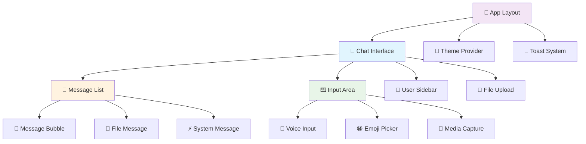

<div align="center">

# 🎨 Chat Anónimo Frontend

<p align="center">
  <strong>Interfaz moderna y responsive para chat anónimo seguro con cifrado end-to-end</strong>
</p>

<p align="center">
  
  
  
  
</p>

<p align="center">
  
  
  
</p>

<p align="center">
  <a href="https://write-ghost.netlify.app"><strong>🌐 Demo en Vivo</strong></a> •
  <a href="https://github.com/h3n-x/chat-backend"><strong>🚀 Backend</strong></a> •
  <a href="https://github.com/h3n-x/chat-anonimo"><strong>📖 Documentación</strong></a>
</p>

</div>

---

## 📋 Tabla de Contenidos

<details>
<summary><strong>Navegación Rápida</strong></summary>

- [🚀 Inicio Rápido](#-inicio-rápido)
- [✨ Características](#-características)
- [🏗️ Arquitectura](#️-arquitectura)
- [⚙️ Instalación](#️-instalación)
- [🔧 Configuración](#-configuración)
- [🧩 Componentes](#-componentes)
- [🎨 Sistema de Diseño](#-sistema-de-diseño)
- [🛠️ Desarrollo](#️-desarrollo)
- [🚀 Deployment](#-deployment)
- [🔗 Enlaces](#-enlaces)

</details>

---

## 🚀 Inicio Rápido

### ⚡ Setup en 30 segundos

```bash
# Clonar e instalar
git clone https://github.com/h3n-x/chat-frontend.git
cd chat-frontend && npm install

# Configurar variables de entorno
echo "NEXT_PUBLIC_WS_URL=wss://chat-backend-haeb.onrender.com" > .env.local
echo "NEXT_PUBLIC_API_URL=https://chat-backend-haeb.onrender.com" >> .env.local

# Ejecutar
npm run dev
```

<div align="center">

**🎯 ¿Sin tiempo para instalar?**

**[Prueba la demo en vivo →](https://write-ghost.netlify.app)**

</div>

---

## ✨ Características

<table>
<tr>
<td width="50%">

### 🎨 **Experiencia de Usuario**]]] 🌙 **Modo Oscuro/Claro** automático
- 📱 **Totalmente Responsive** (móvil → 4K)
- ⚡ **Carga ultrarrápida** (< 2s)
- 🎭 **Animaciones fluidas**
- 🔔 **Notificaciones inteligentes**
- 🎵 **Feedback auditivo opcional**

</td>
<td width="50%">

### 🔐 **Seguridad y Privacidad**
- 🔒 **Cifrado AES-256-GCM** en cliente
- 🔑 **Gestión segura de claves**
- 🚫 **Zero tracking** (sin cookies)
- 🛡️ **Protección XSS**
- 🌐 **HTTPS forzado**
- 🔄 **Claves no persistentes**

</td>
</tr>
<tr>
<td width="50%">

### 💬 **Funcionalidades de Chat**
- 📨 **Tiempo real** con WebSocket
- 📁 **Drag & Drop** hasta 15MB
- 🖼️ **Vista previa multimedia**
- 👥 **Lista usuarios en vivo**
- ✍️ **Indicador de escritura**
- 🏠 **Salas privadas** (códigos 6 dígitos)

</td>
<td width="50%">

### 🎛️ **Stack Tecnológico**
- ⚛️ **React 18** con Concurrent Features
- 🔷 **TypeScript** estricto
- 🏗️ **Next.js 14** App Router
- 💨 **TailwindCSS** utility-first
- 🎭 **Shadcn/UI** componentes accesibles
- 🔄 **SWR** para data fetching

</td>
</tr>
</table>

---

## 🏗️ Arquitectura

### 📊 Diagrama de Componentes



### 📁 Estructura del Proyecto

<details>
<summary><strong>Ver estructura completa</strong></summary>

```
chat-frontend/
├── 📱 app/                    # Next.js 14 App Router
│   ├── 🏠 page.tsx           # Página principal
│   ├── 🎨 layout.tsx         # Layout raíz
│   ├── 🌐 globals.css        # Estilos globales
│   └── 🔧 not-found.tsx      # Página 404
├── 🧩 components/             # Componentes React
│   ├── 💬 chat/              # Componentes de chat
│   │   ├── interface.tsx     # Interfaz principal
│   │   ├── message.tsx       # Componente mensaje
│   │   ├── input.tsx         # Input de mensaje
│   │   └── user-list.tsx     # Lista usuarios
│   ├── 📁 file/              # Gestión de archivos
│   │   ├── upload.tsx        # Drag & drop
│   │   ├── preview.tsx       # Vista previa
│   │   └── progress.tsx      # Barra progreso
│   ├── 🏠 room/              # Gestión salas
│   │   ├── manager.tsx       # Crear/unirse
│   │   ├── list.tsx          # Lista salas
│   │   └── settings.tsx      # Configuración
│   ├── 🎭 ui/                # Componentes base UI
│   │   ├── button.tsx        # Botones
│   │   ├── input.tsx         # Inputs
│   │   ├── modal.tsx         # Modales
│   │   ├── toast.tsx         # Notificaciones
│   │   └── ...               # Más componentes
│   └── 🔔 notifications/     # Sistema notificaciones
├── 🔧 lib/                   # Utilidades y lógica
│   ├── 📡 api/               # Comunicación backend
│   │   ├── websocket.ts      # Gestión WebSocket
│   │   ├── http.ts           # Requests HTTP
│   │   └── types.ts          # Tipos TypeScript
│   ├── 🔐 crypto/            # Cifrado frontend
│   │   ├── aes.ts            # Implementación AES
│   │   ├── keys.ts           # Gestión claves
│   │   └── utils.ts          # Utilidades crypto
│   ├── 🛠️ utils/             # Utilidades generales
│   │   ├── format.ts         # Formateo datos
│   │   ├── validation.ts     # Validaciones
│   │   └── constants.ts      # Constantes
│   └── 🎨 styles/            # Configuración estilos
├── 📦 hooks/                 # Custom React Hooks
│   ├── 📱 use-mobile.ts      # Detección móvil
│   ├── 🔔 use-toast.ts       # Sistema toast
│   ├── 🌙 use-theme.ts       # Gestión tema
│   ├── 📡 use-websocket.ts   # WebSocket hook
│   └── 🔐 use-crypto.ts      # Cifrado hook
├── 🎯 public/                # Recursos estáticos
│   ├── 🖼️ images/            # Imágenes
│   ├── 🔊 sounds/            # Sonidos notificación
│   ├── 🎨 icons/             # Iconos SVG
│   └── 📄 manifest.json      # PWA manifest
├── 🧪 __tests__/             # Tests unitarios
├── 📊 .storybook/            # Storybook config
├── 🔧 config/                # Configuraciones
│   ├── tailwind.config.js    # TailwindCSS
│   ├── next.config.mjs       # Next.js
│   └── tsconfig.json         # TypeScript
└── 📦 package.json           # Dependencias
```

---

## ⚙️ Instalación

### 📋 Requisitos del Sistema

| Herramienta | Versión Mínima | Recomendada | 
|-------------|----------------|-------------|
| **Node.js** | 18.0.0 | 20.x LTS |
| **npm** | 8.0.0 | 10.x |
| **Git** | 2.20.0 | Latest |

### 🛠️ Instalación Paso a Paso

<details>
<summary><strong>Instalación Detallada</strong></summary>

```bash
# 1️⃣ Verificar requisitos
node --version    # >= 18.0.0
npm --version     # >= 8.0.0

# 2️⃣ Clonar repositorio
git clone https://github.com/h3n-x/chat-frontend.git
cd chat-frontend

# 3️⃣ Instalar dependencias
npm install
# o usando pnpm (más rápido)
pnpm install

# 4️⃣ Configurar variables de entorno
cp .env.example .env.local
# Editar .env.local con tus configuraciones

# 5️⃣ Ejecutar en desarrollo
npm run dev

# 6️⃣ Verificar instalación
# Abrir: http://localhost:3000
```

</details>

---

## 🔧 Configuración

### 🌍 Variables de Entorno

```bash
# .env.local
NEXT_PUBLIC_WS_URL=wss://chat-backend-haeb.onrender.com
NEXT_PUBLIC_API_URL=https://chat-backend-haeb.onrender.com
NEXT_PUBLIC_MAX_FILE_SIZE=15728640  # 15MB
NEXT_PUBLIC_SUPPORTED_FORMATS=jpg,jpeg,png,gif,pdf,txt,doc,docx
```

### 🎛️ Scripts Disponibles

<details>
<summary><strong>Ver todos los scripts</strong></summary>

```bash
# 🏃 Desarrollo
npm run dev          # Servidor desarrollo
npm run dev:turbo    # Modo turbo

# 🏗️ Build
npm run build        # Build producción
npm run start        # Servidor producción
npm run export       # Export estático

# 🧪 Testing
npm run test         # Tests unitarios
npm run test:watch   # Tests en watch
npm run e2e          # Tests e2e

# 📊 Code Quality
npm run lint         # ESLint
npm run format       # Prettier
npm run type-check   # TypeScript

# 📖 Documentación
npm run storybook    # Storybook server
npm run analyze      # Bundle analyzer
```

</details>

---

## 🎨 Sistema de Diseño

### 🌈 Paleta de Colores

<table>
<tr>
<td width="50%">

**🌞 Modo Claro**
```css
--background: 0 0% 100%;
--foreground: 222.2 84% 4.9%;
--primary: 221.2 83.2% 53.3%;
--secondary: 210 40% 96%;
--muted: 210 40% 96%;
--accent: 210 40% 96%;
--destructive: 0 84.2% 60.2%;
--border: 214.3 31.8% 91.4%;
```

</td>
<td width="50%">

**🌙 Modo Oscuro**
```css
--background: 222.2 84% 4.9%;
--foreground: 210 40% 98%;
--primary: 217.2 91.2% 59.8%;
--secondary: 217.2 32.6% 17.5%;
--muted: 217.2 32.6% 17.5%;
--accent: 217.2 32.6% 17.5%;
--destructive: 0 62.8% 30.6%;
--border: 217.2 32.6% 17.5%;
```

</td>
</tr>
</table>

### 📱 Responsive Breakpoints

```css
/* Tailwind Breakpoints */
sm: 640px   /* Móvil grande */
md: 768px   /* Tablet */
lg: 1024px  /* Desktop */
xl: 1280px  /* Desktop grande */
2xl: 1536px /* 4K */
```

---

## 🛠️ Desarrollo

### 🔧 Setup para Desarrollo

```bash
# Setup completo
git clone https://github.com/h3n-x/chat-frontend.git
cd chat-frontend

# Instalar herramientas globales
npm install -g @playwright/test

# Setup del proyecto
npm install
npm run setup
npm run prepare  # Git hooks
```

### 🧪 Testing

```bash
# Tests unitarios
npm run test

# Tests con coverage
npm run test:coverage

# Tests e2e
npm run e2e

# Tests en modo watch
npm run test:watch
```

### 📊 Code Quality

```bash
# Linting
npm run lint
npm run lint:fix

# Formateo
npm run format

# Type checking
npm run type-check

# Bundle analysis
npm run analyze
```

---

## 🚀 Deployment

### 🌐 Netlify (Recomendado)

```bash
# Build para producción
npm run build
npm run export

# Deploy automático via Git
# Conectar repo en Netlify Dashboard
```

### ⚙️ Variables de Entorno en Producción

```bash
NEXT_PUBLIC_WS_URL=wss://tu-backend.com
NEXT_PUBLIC_API_URL=https://tu-backend.com
```

---

## 🔗 Enlaces y Recursos

### 📚 **Documentación**
- 🏠 [**Documentación Principal**](https://github.com/h3n-x/chat-anonimo)
- 🚀 [**Backend Repository**](https://github.com/h3n-x/chat-backend)
- 📖 [**Next.js Docs**](https://nextjs.org/docs)
- 💨 [**TailwindCSS Docs**](https://tailwindcss.com/docs)

### 🤝 **Contribución**
- 🐛 [**Issues**](https://github.com/h3n-x/chat-frontend/issues)
- 💬 [**Discussions**](https://github.com/h3n-x/chat-frontend/discussions)
- 🔄 [**Pull Requests**](https://github.com/h3n-x/chat-frontend/pulls)

### 🚀 **Deployment**
- 🌐 [**Frontend Live**](https://write-ghost.netlify.app)
- 📊 [**Netlify Dashboard**](https://app.netlify.com/sites/write-ghost)
- 🔍 [**Performance Report**](https://pagespeed.web.dev/analysis/https-write-ghost-netlify-app)

### 🛠️ **Herramientas**
- 📖 [**Storybook**](http://localhost:6006) (modo dev)
- 🧪 [**Testing Playground**](https://testing-playground.com)
- 🎨 [**Tailwind Play**](https://play.tailwindcss.com)

---

<div align="center">

## 🎉 ¡Gracias por usar Chat Anónimo Frontend!

**Interfaz moderna, segura y privada para comunicación anónima**

<p align="center">
  <a href="https://write-ghost.netlify.app">🌟 <strong>Prueba la Demo</strong></a> •
  <a href="https://github.com/h3n-x/chat-frontend/issues">🤝 <strong>Contribuir</strong></a> •
  <a href="https://github.com/h3n-x/chat-anonimo">📖 <strong>Documentación</strong></a>
</p>

---

**Hecho con ❤️ para la privacidad, seguridad y gran experiencia de usuario**

<p align="center">
  <a href="#-chat-anónimo-frontend">⬆️ Volver al inicio</a>
</p>

</div>
